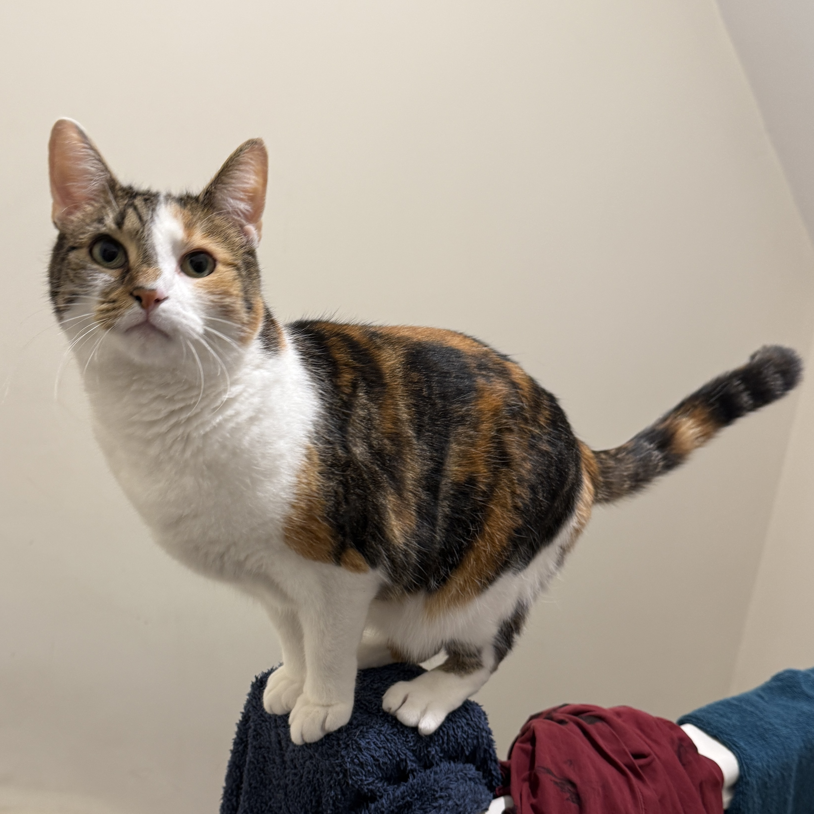
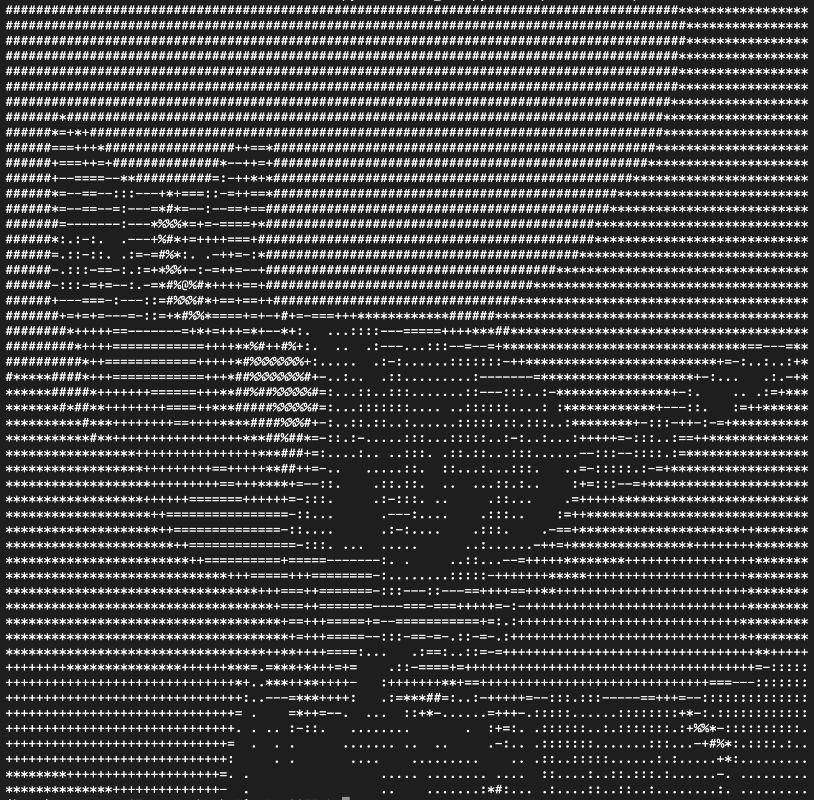

# ArtSCII 🎨➡️🔡

 


ArtSCII is a Python project that converts images into ASCII art. It takes an input image and transforms it into a text representation using ASCII characters, allowing you to visualize images in a unique and artistic way using only text.

## Examples

| Original Image | ASCII Output |
|:-------------:|:-----------:|
|  |  |

## Project Goals

- Convert images to ASCII art with customizable width and character sets.
- Provide options to invert brightness.
- Allow saving the ASCII art output to a text file.
- Create a simple and user-friendly command-line interface (CLI).

## Current Status

- [x] Basic image to ASCII conversion
- [x] Width adjustment
- [x] Brightness inversion
- [x] Dense character set option
- [x] Output to file option
- [ ] Web app interface (coming soon)

## Project Structure

```
ArtSCII/
├── ascii_core.py      # Core ASCII conversion logic
├── ascii_art.py       # CLI interface
├── requirements.txt   # Dependencies
├── README.md          # Documentation
├── Examples/          # Sample images and outputs for README examples
└── Output/            # Default output folder (ignored in git)
```

## CLI Usage

```bash
python artSCII.py path/to/image.jpg --width 100 --invert --dense --output output.txt
```

### Basic Usage

```bash
python artSCII.py path/to/image.jpg
```

### Advanced Usage

#### Optional Flags

- `--width` or `-w`: Specify the width of the ASCII output. Defaults to terminal width if not set.
- `--invert` or `-i`: Invert brightness mapping.
- `--dense` or `-d`: Use a denser character set for more detail.
- `--output` or `-o`: Save ASCII art to a text file instead of printing to the console.

```bash
python artSCII.py path/to/image.jpg --width 100 --invert --dense --output output.txt
```


## Note

A web app version of ArtSCII is in development and will be released soon!
